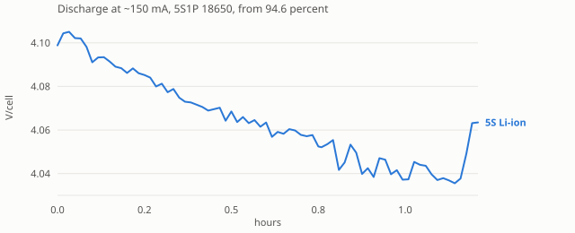
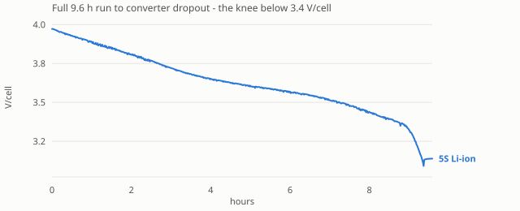
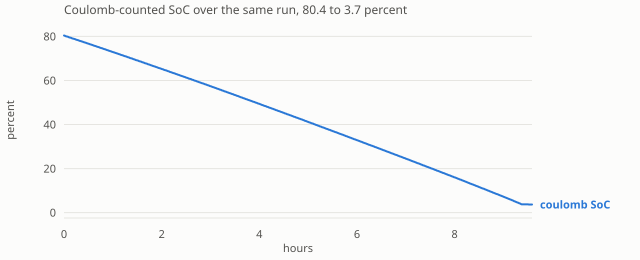
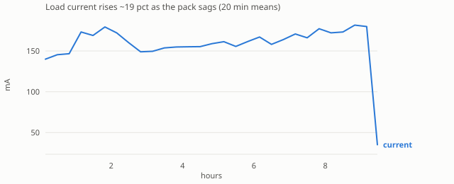
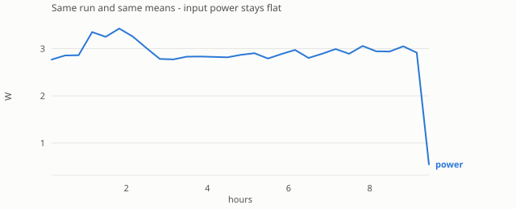
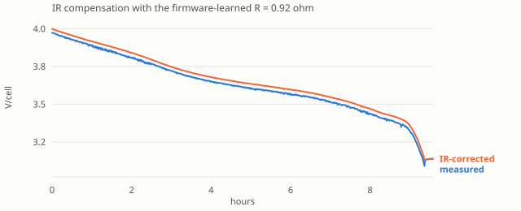
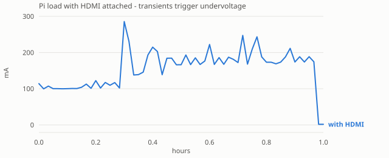
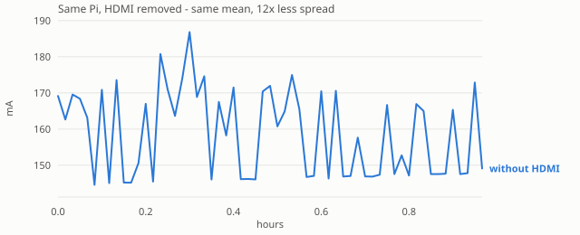

# ESP32-C3 + INA228 Battery Power Meter - Development Plan

**Date:** 2026-08-13
**Supersedes the "what's left to build" section of `battery-monitor-handoff.md`; that document remains the authority on hardware/electrical design.**

---

## 0. Decisions taken

| Question | Decision |
|---|---|
| Link to Pi | **USB Serial/JTAG** (`/dev/ttyACM0`) default; UART1 selectable via Kconfig |
| Log routing | **Ring buffer only.** AT link is strictly request/response, never unsolicited |
| OTA framing | **`ATFW=<len>,<md5>` + raw binary stream** |
| Existing `main/` | **Deleted.** Clean slate |
| Pack config (5S/6S, Ah, thresholds) | **Runtime, via `ATS`** - not a build-time constant |

That last row matters: because `ATS` carries chemistry, series/parallel, capacity, Vmin, Vmax and Imax, open questions S9.1 and S9.2 of the handoff are no longer blocking. The firmware ships knowing nothing about the pack and is told at provisioning time.

---

## 1. Transport layer

### 1.1 Why the abstraction exists

The AT parser, OTA receiver and JSON emitter are written once against a 4-function interface:

```c
// link.h
esp_err_t link_init(void);
int  link_read (uint8_t *buf, size_t len, uint32_t timeout_ms); // bytes read, 0 on timeout
int  link_write(const uint8_t *buf, size_t len);                // never blocks > ~20 ms
void link_flush(void);
```

Two implementations, `link_usb.c` and `link_uart.c`, selected by Kconfig. No `#ifdef` leaks above this line.

### 1.2 USB Serial/JTAG specifics (the default)

- Peripheral is fixed to **GPIO18 (D-) / GPIO19 (D+)**. These pins are unavailable for anything else.
- No TinyUSB, no descriptors, no VID/PID config. `usb_serial_jtag_driver_install()` and go.
- Enumerates purely on the D+ pull-up, which asserts whenever the C3 is powered. **There is no VBUS sense**, so a VBUS-cut cable works - resolving handoff S5 cleanly. Do not connect USB +5 V: the module is self-powered from the battery, and on the SuperMini the `5V` pin and USB VBUS are the same net (hardware.md S5).

**! The one real trap: writes when no host is attached.**
`usb_serial_jtag_write_bytes()` blocks until the host drains the FIFO. If nothing drains it, a naive write stalls the fuel-gauge loop indefinitely. This is the *normal* state, not an edge case: the module is self-powered and counts continuously whether or not a host is attached (hardware.md S11). It may run for weeks with nothing on the other end of the USB cable. Mitigations, all required:

1. Every `link_write` uses a short finite timeout (<=20 ms) and **discards on timeout**. Losing a response to a host that isn't listening is correct behaviour.
2. Coulomb counting lives in its own FreeRTOS task, independent of the AT task. The gauge must never be downstream of link I/O.
3. `usb_serial_jtag_is_connected()` gates chatty paths.

### 1.3 UART alternative

UART1, **ESP32 TX=GPIO6 -> Pi RX (header GPIO15)**, **ESP32 RX=GPIO7 <- Pi TX (header GPIO14)**, common GND. 115200 8N1 default,

> Corrected: an earlier revision of this file, and handoff S5, gave the ESP32 side as GPIO14/15. Those are the **Pi header** numbers; on the ESP32-C3, GPIO14/15 are SPI flash pins and unusable. See `hardware.md` S4.2. `ATB=<baud>` optional later. No flow control; OTA relies on the ESP32 keeping up, which it does at <=921600 since `esp_ota_write` is faster than the wire.

### 1.4 Logging and console

`CONFIG_ESP_CONSOLE_NONE=y` for the shipping build. `esp_log_set_vprintf()` installs a **capture-only** interceptor (the pattern from the old canspeed `log_intercept`, minus the pass-through to the original vprintf). Logs go to a 64x160 B RAM ring buffer and surface only via `ATL`.

Consequence to accept knowingly: **a boot-time panic or bootloader failure produces no visible output on the AT link.** For bench debugging, ROM/bootloader messages still emit on UART0 TX (GPIO21) - keep a 3-pin header on GPIO21/GND and attach an FTDI when something is genuinely broken. A `CONFIG_PM_DEBUG_CONSOLE` Kconfig option re-enables the normal console for development builds.

---

## 2. Serial protocol specification

**Framing:** one command per line, terminated `\r\n` (accept bare `\n`). Commands are case-insensitive, <=256 B. One response line per command, `\r\n` terminated. Strictly request/response - the device never speaks first.

**Error format:** `ERROR <code> <description>`

| Code | Meaning |
|---|---|
| 1 | Syntax error / malformed line |
| 2 | Unknown command |
| 3 | Parameter out of range or unparseable |
| 4 | Not provisioned (no `ATS` stored) |
| 5 | INA228 fault (I2C failure, ID mismatch, ADC overflow) |
| 6 | NVS read/write failure |
| 7 | OTA failure (partition, write, or end/verify) |
| 8 | Timeout during binary transfer |
| 9 | MD5 mismatch |

### 2.1 Commands

| Command | Response | Notes |
|---|---|---|
| `AT` | `OK` | Keepalive. Must answer in <5 ms |
| `ATZ` | `OK` then reboot | Flush NVS, reply, 100 ms delay, `esp_restart()` |
| `ATI` | `<fwver>,<git sha>,<build date>,<chip>,<mac>` | Version/identity. Needed to make OTA safe |
| `ATS=<chem>,<xSyP>,<mAh>,<Vmin>,<Vmax>,<Imax>[,<pack_id>]` | `OK` \| `ERROR n ...` | Provision pack. Persist to NVS |
| `ATS?` | current config, same field order | Read-back. Non-negotiable for a provisioning command |
| `ATA` | JSON line | Live measurement + SoC |
| `ATL` | log lines then `OK` | Multi-line; see S2.4 |
| `ATFW=<bytes>,<md5hex>` | `OK` -> binary -> `OK` \| `ERROR n` | OTA; see S2.5 |
| `ATR` | `OK` | Declare pack swap, seed 100% - remote equivalent of the long press (S2.6) |
| `ATC=<mAh>` | `OK` | Force remaining capacity - manual gauge correction |

`ATI`, `ATS?`, `ATR`, `ATC` are additions to the original sketch. `ATS?` and `ATI` are needed for any safe provisioning or OTA flow.

**`ATR` is deliberately demoted.** The hardware button (S2.6) is the primary swap interface; `ATR` invokes the identical code path and costs ~5 lines. It is kept for: sealed enclosures with no reachable button, headless/remote operation, scripted testing (a harness cannot press a button), and recovery if the button fails. **`ATC` is not a duplicate of it** - `ATR` means "new pack, assume full", `ATC=<mAh>` means "it is exactly this much", for a bench-charged pack of known content or a drift correction that shouldn't wait for the next full-charge anchor.

### 2.2 `ATS` parameter validation

```
chem   ? {LifePo, LiIon, AGM, Acid}       (case-insensitive)
xSyP   matches ^[0-9]{1,2}S[0-9]{1,2}P$   e.g. 6S1P
mAh    1 ... 1000000
Vmin   0.1 ... 100.0   V, pack level
Vmax   Vmin ... 100.0  V, pack level
Imax   0.01 ... 10.0   A   (Adafruit 5832, 15 mOhm shunt -> +/-10.9 A ceiling)
```

**`Vmax` is the charge ceiling, not the resting-full voltage.** These are nearly the same for lithium but differ sharply for lead-acid, so the distinction must be explicit:

| Chemistry | `Vmax` = charge ceiling | Resting full (from the OCV table, S4) |
|---|---|---|
| `LiIon` 5S | 21.0 V (4.20/cell) | 21.0 V (4.20/cell) |
| `LifePo` 6S | 21.9 V (3.65/cell) | 20.4 V (3.40/cell) |
| `AGM` 12 V | **14.7 V** (2.45/cell) | **12.85 V** (2.14/cell) |
| `Acid` 12 V | **14.4 V** (2.40/cell) | **12.70 V** (2.12/cell) |

No extra parameter is needed: `Vmax` bounds what the hardware must tolerate and defines "full" *while charging*; the per-chemistry OCV table supplies resting values.

Cross-check: warn (do not reject) if `Vmax / xS` falls outside **4.0-4.25** V/cell (`LiIon`), **3.5-3.75** (`LifePo`), or **2.30-2.50** (`AGM`, `Acid`). Vmin/Vmax are stored pack-level; per-cell figures are derived by dividing by the S count.

**`pack_id`** is an optional 7th field, 1-15 chars of `[A-Za-z0-9_-]`, default
`default`. Each pack gets its own NVS record plus a separate `active` key, so
returning to a known battery restores its stored count and learned capacity
rather than re-seeding. See `main/storage.c`.

> The parser uppercases the command word only, stopping at the first `=`.
> Everything after it is data: `pack_id` is case-sensitive, and chemistry
> names are matched case-insensitively anyway.

Anything invalid -> `ERROR 3 <field name>`, naming the field rather than only
the code.

**Apply the calibration before persisting.** If `Imax x Rshunt` overflows the
15-bit `SHUNT_CAL` the hardware rejects it, and the config must not reach NVS
or every later boot would reload a configuration already known to fail.

Measured effect of a realistic `Imax` on the 15 mOhm shunt:

| `Imax` | `CURRENT_LSB` | ADCRANGE | Shunt full scale |
|---|---|---|---|
| 10.0 A (unprovisioned default) | 19.07 uA | 0 | 150 mV |
| 2.5 A | **4.77 uA** | **1** | 37.5 mV |

`SHUNT_CAL` is unchanged at 3750 across that switch, which is correct rather
than a bug: `CURRENT_LSB` falls 4x while the ADCRANGE=1 multiplier is 4x.

### 2.3 `ATA` response

Single-line JSON, per handoff S6:

```json
{"v":19.8400,"i":1.42000,"p":28.2000,"t":31.4,"soc":73.0,"mah_left":2620,"mah_used":1180,"wh":22.40,"v_ocv":20.1200,"r":0.935,"v_full":4.121,"state":"discharging","est":false,"q_c":5527.129,"e_j":100102.30,"err":0}
```

- `i` sign convention: **positive = discharge** (current leaving the pack).
- `state` -> `charging | discharging | idle | full | unknown`.
- `est:true` means SoC came from OCV in the curve's flattest stretch (3.60-3.90 V/cell) and is worth +/-10 %, rather than from a coulomb count or a near-full reading.
- `v_ocv` is pack-level and IR-compensated (`v + i * r`); `r` is the learned `R_total` in ohms. Both are 0 until R has been learned, in which case `v_ocv` equals `v`.
- `v_full` is the **learned resting-full volts per cell** for this pack, `0.000` until the pack has been declared full at least once. See S4.4.1 - it is what rescales the OCV curve, and on a fleet of tool packs it is the field that tells you what each pack's charger actually does.
- `q_c` and `e_j` come straight from the INA228's hardware accumulators, so they are unaffected by how often the host polls.
- `err` is a bitmask of latched faults, mirroring what `ATL` explains in words.

The SoC fields (`soc`, `mah_left`, `mah_used`, `wh`, `v_ocv`, `r`, `v_full`, `state`, `est`) are **omitted entirely** when no pack is provisioned, rather than emitted as nulls - an unprovisioned device is still a working voltmeter and ammeter, and a host must not be able to bind to numbers that do not mean anything.

### 2.4 `ATL` output

```
<n> lines follow
[  1234] W ina: read timeout
[  5678] E gauge: charge overflow, accumulator reset
OK
```

Ring buffer drains-on-read is **not** used - `ATL` is idempotent and returns the current buffer contents, so a dropped response doesn't lose the log.

### 2.5 `ATFW` OTA sequence

```
host -> ATFW=278768,a1b2c3...\r\n
dev  -> OK 2048\r\n               device is in raw binary mode; 2048 = chunk size
host -> <2048 raw bytes>
dev  -> "."                       chunk written; send the next
host -> <2048 raw bytes>
dev  -> "."
         ... repeat; final chunk may be short ...
dev  -> OK\r\n                    MD5 verified, boot partition set
     |  ERROR 7/8/9 ...           nothing changed, current image kept
dev  -> reboot
```

**The transfer is ACK-paced, not a free-running stream.** This is the single most important implementation detail here, and it was found the hard way - see the box below.

Rules:
- **Everything rejectable is rejected *before* the `OK`.** Size and MD5-format validation happen first, because `OK` commits the host to streaming binary immediately; an error after it would be read as the result of a transfer that never started.
- The handshake reply is **`OK <chunk>`**, so the host paces itself to whatever the build uses rather than both sides hardcoding a constant that can drift. Hosts should accept a bare `OK` and assume 2048.
- After each chunk is written the device emits a single **`.`**; the host sends the next chunk only after seeing it. The last chunk may be short.
- `bytes` bounded by the target partition; reject larger with `ERROR 3`.
- Inter-byte timeout 5 s -> `esp_ota_abort()`, `ERROR 8`, **flush RX**, return to line mode.
- MD5 computed streaming (`mbedtls_md5`) while writing; compared *before* `esp_ota_end()`.
- Anti-bricking: `CONFIG_BOOTLOADER_APP_ROLLBACK_ENABLE=y` is in `sdkconfig.defaults`. A new image boots `PENDING_VERIFY` and calls `esp_ota_mark_app_valid_cancel_rollback()` only after **a successful INA228 probe and one served command** - proving it can talk to both the sensor and the host. Anything less and the bootloader reverts.

> ### ! Why flow control is mandatory
>
> **The USB Serial/JTAG driver silently discards data when its RX ring overflows.** No error, no backpressure - the bytes are simply gone.
>
> The host writes at USB speed (~1 MB/s); the device drains at the speed it can write flash (~150 kB/s). A free-running 278 KB stream is written by the host in 1.6 s, of which the device sees about 132 KB. The rest evaporates, and the device then waits out its timeout for data that no longer exists.
>
> **`OTA_CHUNK` must be smaller than the link's RX buffer** (currently 2048 vs 4096). The ACK paces the host *between* chunks, not within one, so a chunk larger than the ring overflows it mid-chunk. The signature of getting this wrong is unmistakable once seen: **a timeout reporting exactly `rx_buffer_size` bytes received.**
>
> Both constraints are asserted in comments at `main/ota.h` and `main/link_usb.c`. Changing either buffer requires re-checking the other.

**Line termination:** the parser dispatches on `LF` and discards `CR`. Dispatching on `CR` would leave the `LF` of a CRLF pair queued - and after `ATFW` that stray byte becomes the **first byte of the firmware image**, shifting the entire transfer and failing header validation with a misleading `ESP_ERR_OTA_VALIDATE_FAILED`.

**On failure the device flushes RX.** Otherwise unread payload is parsed as AT commands, producing a flood of errors and a desynchronised link.

### 2.6 Button + LED user interface

**One plain monochrome LED. No RGB, no addressable LED.** All feedback is encoded in blink counts and timing. Colour would carry no information the patterns don't already carry unambiguously, and dropping it removes the `led_strip` component and the RMT peripheral from the build - the driver is a GPIO toggle and a software timer, nothing more.

**Why the button exists at all.** Pack removal kills ESP32 power, so `esp_reset_reason() == ESP_RST_POWERON` is a reliable "power was lost" signal - but it does *not* mean "pack swapped". It also fires on brownout, loose connector, vibration and DC-DC hiccup, where the pack is unchanged and the count is still good. Resting-voltage comparison resolves most of that (S4), but not the case that matters: on a flat-curve chemistry (`LifePo`, and lead-acid without a long rest) a 20 %-SoC and an 80 %-SoC battery can sit within millivolts per cell. Swap one for the other and the firmware would confidently keep a badly wrong count. That is unfixable in software - it needs a human to assert it. On `LiIon` the OCV table (S4) resolves it automatically, so the button matters most on flat-curve chemistries.

#### Gestures

| Gesture | Meaning | LED response |
|---|---|---|
| **Double press** (2 presses <600 ms apart) | Report SoC | 3 fast blinks (ack), pause, then **N slow blinks where N = round(SoC/10)** |
| **Long press >=5 s** | New pack, assume full | **5 medium blinks** = accepted |
| Long press released <5 s | Cancelled | 1 long blink |
| Long press rejected (S2.6 guard) | Refused | 10 rapid flutter blinks |
| Single short press | *nothing* | - deliberately inert, so an accidental bump does nothing |

**SoC report encoding** (works on any single LED):
- 2 fast blinks @60 ms = "SoC follows"
- N slow blinks @300 ms, N = 1...10 -> 10%...100%
- SoC < 5% -> one 1 s blink instead
- If `est:true`, append 2 fast blinks = "this is an estimate, not anchored"

#### Serial activity indication

| Event | Pattern |
|---|---|
| Any command answered `OK` | **single ~20 ms flicker** |
| Any command answered `ERROR` | **3 fast blinks over 1 s**, one-shot |

**The flicker must be a flicker, not a blink.** The Pi polls `ATA` at 1 Hz (S7), so a 200-500 ms "blink on OK" would produce a permanent 1 Hz pattern in normal operation - visually identical to the 0.5 s fault blink below, turning the alarm indication into the everything-is-fine indication. A 20 ms flicker is unmistakable against any other pattern in this table, and at ~2 % duty costs nothing in standby.

Both are one-shot and never repeat on their own, so neither can be confused with the continuous fault state. Gate with `CONFIG_PM_LED_ACTIVITY` (default on) - an enclosure with a visible LED may want it off once deployed.

#### The long-press guard

"Assume full" seeds `mah_remaining = mah_full`, `est:false`. If the user presses it on a pack that is visibly *not* full, the gauge becomes confidently wrong - worse than not knowing. So the long press is **refused** (flutter pattern, no state change) when resting voltage is below ~3.30 V/cell. In that case the gauge falls back to knee-based voltage seeding with `est:true`. The button asserts a swap; it does not get to override physics.

#### Idle behaviour

LED **off** when idle. The module is self-powered and runs continuously (hardware.md S11), so a lit LED would drain the battery 24/7 - against a ~7 mA total budget, a 20 mA LED would quadruple it. Idle-off is both a power decision and what keeps the fault blink meaningful.

**Fault state: continuous blink at a 0.5 s interval** (0.5 s on / 0.5 s off) for as long as `err != 0` - a dead or unreachable INA228 is then obvious across the room without a serial connection. It is the only pattern that runs unprompted, and it is deliberately distinct from every gesture response, all of which are short bursts that end.

Gesture feedback preempts the fault blink and the fault blink resumes afterwards. A double press while faulted still reports the last known SoC, but appends the `est:true` marker (2 fast blinks) - the count is stale by definition once the sensor is gone.

> Power note: a fault may blink for days unattended. Against the ~7 mA total (hardware.md S8), a 20 mA LED at 50 % duty would more than double battery drain. Size the panel LED's series resistor for **~2 mA** - it only has to be visible.

#### Complete LED vocabulary - checked for collisions

Every pattern must be distinguishable from every other on a **single monochrome LED**. Priority: fault blink is the resting state when faulted; all others preempt it and it resumes.

| Pattern | Meaning | Repeats? |
|---|---|---|
| ~20 ms flicker | command OK | one-shot |
| 3 x fast blink over 1 s | command ERROR | one-shot |
| 2 x fast @60 ms, then N x slow @300 ms | SoC report, N = SoC/10 | one-shot |
| ...+ 2 x fast suffix | SoC is an estimate (`est:true`) | one-shot |
| 1 x 1 s blink | SoC < 5%, **or** long press cancelled | one-shot |
| 5 x medium @200 ms | "new pack, assume full" accepted | one-shot |
| 10 x rapid @60 ms | long press refused (pack not full) | one-shot |
| **0.5 s on / 0.5 s off** | **INA228 fault** | **continuous** |

Disambiguation notes, since three pairs are close:
- *Flicker (20 ms) vs. everything*: separated by duration alone. Nothing else is under 60 ms.
- *ERROR (3 fast) vs. SoC ack (2 fast)*: differ by count; the SoC ack is always followed by slow blinks, ERROR never is.
- *"Assume full" (5 medium) vs. SoC = 50% (5 slow)*: the SoC report is always prefixed by the 2-fast ack, and 200 ms = 300 ms.
- *1 s blink* is overloaded across SoC < 5% and press-cancelled, which is acceptable: one follows a double press, the other follows a released long press, so the user always knows which they just did.

Debounce 20 ms, all timing in the `at` task or a dedicated low-priority task - **never** in an ISR beyond edge capture, and never on the `gauge` task's path.

#### Hardware - pin is configurable, because it moves

The button pin **changes between dev and production**, so it is a Kconfig value from the first commit, never a constant:

```
CONFIG_PM_BUTTON_GPIO        9 (dev, onboard BOOT) -> 10 (production, case-mounted)
CONFIG_PM_BUTTON_ACTIVE_LOW  y
CONFIG_PM_LED_GPIO           8 (dev, onboard) -> panel LED in production
CONFIG_PM_LED_ACTIVE_LOW     per board
```

Dev uses the onboard BOOT button (GPIO9) and LED (GPIO8) - no extra parts. Production moves both to the enclosure: button on **GPIO10** (no strapping function, so the download-mode interaction disappears in the shipping build) and a panel LED on a free pin. Wiring for both is in hardware.md S4.3.

! **Dev-board constraint from dropping RGB:** the onboard GPIO8 LED must be a *plain* LED. Seeed XIAO ESP32-C3 and the C3 "super mini" boards qualify. **ESP32-C3-DevKitM-1 does not** - its GPIO8 LED is an addressable WS2812, which ignores plain high/low levels and will simply never light. Pick the dev board accordingly, or accept no LED feedback until the production panel LED exists.

Firmware requires the button to be **released before arming** gesture detection, so a press held across a reset can't instantly register as a 5 s hold. Relevant only on the GPIO9 dev build, harmless to keep.

---

## 3. INA228 driver

### 3.1 Registers used

| Addr | Name | Width | LSB |
|---|---|---|---|
| 0x00 | CONFIG | 16 | `RSTACC` bit resets accumulators; `ADCRANGE` bit |
| 0x01 | ADC_CONFIG | 16 | mode, conversion times, averaging |
| 0x02 | SHUNT_CAL | 16 | calibration |
| 0x04 | VSHUNT | 24 (>>4, signed) | 312.5 nV (range 0) / 78.125 nV (range 1) |
| 0x05 | VBUS | 24 (>>4, unsigned) | 195.3125 uV |
| 0x06 | DIETEMP | 16 | 7.8125 mdegC |
| 0x07 | CURRENT | 24 (>>4, signed) | `CURRENT_LSB` |
| 0x08 | POWER | 24 | `3.2 x CURRENT_LSB` |
| 0x09 | ENERGY | 40 | `16 x POWER_LSB` |
| 0x0A | CHARGE | 40 (signed) | `CURRENT_LSB` coulombs |
| 0x0B | DIAG_ALRT | 16 | overflow flags, conversion ready |
| 0x3E/0x3F | MANUFACTURER_ID / DEVICE_ID | 16 | `0x5449` ("TI") / `0x228x` |

*All widths, LSB values and the calibration constant below must be re-verified against the TI INA228 datasheet (SBOS736) during Phase 1 before any of it is trusted.*

### 3.2 Calibration is driven by `ATS`

```
CURRENT_LSB = Imax / 2^19
SHUNT_CAL   = 13107.2e6 x CURRENT_LSB x R_shunt      (x4 if ADCRANGE = 1)
```

`R_shunt` = 0.015 Ohm (Adafruit 5832 onboard shunt), a Kconfig value so an external shunt can be swapped in.

**ADCRANGE chosen automatically from `Imax`:**
- `Imax <= 2.7 A` -> **ADCRANGE=1** (+/-40.96 mV, 78.125 nV LSB) - 4x better resolution
- `Imax > 2.7 A` -> **ADCRANGE=0** (+/-163.84 mV, ceiling 10.9 A)

Worked example, `Imax = 10.0 A`: `CURRENT_LSB = 19.07 uA`, `SHUNT_CAL = 3750`. A ~1.4 A load is then resolved to ~0.0014 % - far finer than any voltage-based estimate could achieve, on any chemistry.

### 3.3 Sampling configuration

Continuous shunt+bus+temp, 1052 us conversions, **AVG=64** -> ~200 ms per sample set. Averaging happens in the chip, so the ESP32 polls at 1 Hz and still integrates every microamp: the hardware CHARGE register accumulates continuously regardless of poll rate. This is the entire reason the INA228 was chosen over the INA219/INA260 (handoff S4) - polling frequency does not affect coulomb-count accuracy.

Check `DIAG_ALRT` every poll for `ENERGYOF` / `CHARGEOF`; on overflow, latch the accumulated value into the software total, issue `RSTACC`, and log it.

### 3.4 Fault handling

I2C NACK / timeout -> retry x3 with 10 ms backoff -> latch `err` bit, log, keep last-known values with a staleness flag. Three consecutive failed poll cycles -> re-init the I2C bus and re-probe `DEVICE_ID`. `ATA` reports `err != 0`; `ATL` carries the detail. **The gauge never silently reports stale numbers as live.**

---

## 4. Fuel gauge

State persisted in NVS: `mah_remaining`, `mah_full` (learned capacity, seeded from `ATS`), `est` flag, `cycle_count`, `last_v`, plus a monotonic write counter.

**Primary - coulomb counting.** Poll CHARGE (coulombs, hardware-accumulated), `mAh = C / 3.6`, subtract from remaining. The INA228's CHARGE register is volatile and dies with power (handoff S3), so the ESP32's NVS copy is the real record.

> **The CHARGE register is volatile and dies with battery power.** `RSTACC` on init and treat **NVS as the sole source of truth** for accumulated charge; the register is only ever a delta since the last poll, never an absolute. Power loss means battery disconnection - a swap - which is exactly what the re-seed logic below handles.

**Full-charge anchor (self-heal).** Because the monitor is self-powered and always counting (hardware.md S11), it **does** observe charging that happens in place - so this mechanism is live again. When `V >= Vmax_pack ? 0.1 V` **and** `|I| < C/50` sustained for 60 s -> snap `mah_remaining = mah_full`, clear `est`. If the pre-anchor count differed by >2%, update `mah_full` (capacity learning) and log it.

**Boot-time OCV seeding - the primary re-sync.** Resting open-circuit voltage maps to SoC with an accuracy that depends entirely on chemistry. **The firmware holds one table per chemistry and selects between them at runtime from the `chem` field of `ATS`** - nothing about the pack is compiled in.

On cold boot, rest 60 s (no load, or subtract IR sag), read pack voltage, divide by the S count from `ATS`, and interpolate in the selected table.

> **This runs at the start of every session.** Because the monitor is disconnected from the battery in storage (hardware.md S8), **every use begins with a cold boot** - power-up *is* the normal entry path, not an exception. OCV seeding is therefore the gauge's primary means of establishing SoC, with coulomb counting providing precision *within* a session. NVS persistence still matters, for a battery reconnected shortly after (restore the exact count rather than re-seeding) and for capacity learning across sessions.

**`LiIon`** (NMC) - slopes usably end to end, +/-5-10 %:

| V/cell | SoC | | V/cell | SoC |
|---|---|---|---|---|
| 4.20 | 100 % | | 3.65 | 40 % |
| 4.10 | 90 % | | 3.58 | 30 % |
| 4.00 | 80 % | | 3.50 | 20 % |
| 3.90 | 70 % | | 3.40 | 10 % |
| 3.82 | 60 % | | 3.20 | 5 % |
| 3.72 | 50 % | | 3.00 | 0 % |

`est:true` only in the 3.60-3.90 stretch, the flattest part.

**`LifePo`** - informative only at the two knees; the middle is nearly flat:

| V/cell | SoC |
|---|---|
| 3.45 | 100 % |
| 3.35 | 90 % |
| 3.30 | 70 % |
| 3.28 | 50 % |
| 3.25 | 30 % |
| 3.20 | 20 % |
| 3.00 | 10 % |
| 2.50 | 0 % |

`est:true` across 3.20-3.35 - that band is +/-30 % at best. This is the case the handoff was written for, and the reason coulomb counting is primary.

**`AGM`** - slightly higher resting voltages than flooded, and nearly linear:

| V/cell | SoC | 12 V (6S) |
|---|---|---|
| 2.14 | 100 % | 12.85 |
| 2.09 | 75 % | 12.55 |
| 2.04 | 50 % | 12.25 |
| 1.99 | 25 % | 11.95 |
| 1.93 | 0 % | 11.60 |

**`Acid`** (flooded) - same shape, offset ~20 mV/cell lower:

| V/cell | SoC | 12 V (6S) |
|---|---|---|
| 2.12 | 100 % | 12.70 |
| 2.07 | 75 % | 12.40 |
| 2.03 | 50 % | 12.20 |
| 1.98 | 25 % | 11.90 |
| 1.95 | 0 % | 11.70 |

Both lead-acid tables need a **long rest to settle - hours, not the 60 s used for lithium.** Surface charge alone can read 0.1 V/cell high. Flag `est:true` if the rest was under 30 minutes, which in practice means most boots. Note also that `0 %` here is the fully-discharged point; for cycle life a lead-acid pack should be stopped near 50 %, which is what `Vmin` in `ATS` is for.

### 4.4.1 ! The table's 100 % is not every pack's 100 %

The Li-ion table tops at **4.20 V/cell**, the cell's design charge ceiling. Plenty of packs never go there. **Tool packs commonly terminate near 4.10 V/cell**, trading roughly 8 percent of capacity for a large gain in cycle life, and the measured 5S bench pack settles at **4.085-4.121 V/cell** with its charger showing a steady green and refusing to restart.

Against the raw table that reads **92 percent at full**, and the gauge would under-report by that margin for the pack's entire life. For a product aimed at tool packs that is the common case, not an edge case.

So the gauge **learns each pack's own full voltage** rather than assuming the table's:

- `gauge_persist_t.v_full_pc` holds the learned resting-full volts per cell, per `pack_id`, `0` meaning not yet observed.
- It is recorded whenever the pack is **declared full** - by `ATR`, by the button long press, or by the charge-termination anchor firing. All three take the IR-compensated reading at that moment.
- `gauge_soc_from_ocv` then **scales the whole curve** by `100 / raw_soc(v_full)`.

**Scaling rather than shifting is the physically correct choice.** Charging to 4.10 instead of 4.20 removes the top slice of charge; the mAh held below 4.10 is unchanged. Absolute charge at any lower voltage stays put while the denominator shrinks, so every point rises by the same factor. With `v_full = 4.121`:

| V/cell | raw | scaled |
|---|---|---|
| 4.121 | 92.1 % | **100.0 %** |
| 4.00 | 80.0 % | 86.9 % |
| 3.72 | 50.0 % | 54.3 % |
| 3.40 | 10.0 % | 10.9 % |
| 3.00 | 0 % | 0 % |

Guards, all verified against the reference implementation: the result is monotonic, clamps at 100, still returns exactly 0 at the empty point, and `v_full_pc = 0` reproduces the raw table exactly so nothing changes for a pack that does reach 4.20. A declared full voltage that lands below `GAUGE_ASSUME_FULL_MIN_SOC` (80 percent of table) is **ignored rather than learned** - otherwise one bad `ATR` on a flat pack would inflate every later reading.

> **Why not reuse `Vmax` from `ATS`?** Because `Vmax` is the *charge ceiling*, not the resting-full voltage, and `config.h` says so explicitly. For lead-acid the two differ by ~1.8 V - a charger drives 2.40 V/cell into a pack that rests at 2.14. Deriving "full" from `Vmax` would work for lithium and be badly wrong for the two lead-acid chemistries. Learning it costs one float and is right for all four.

**Assume-full is judged on table percent, not on a fixed voltage.** The original test was `t[0].v - (t[0].v - t[1].v) * 0.8`, i.e. 4.12 V/cell for Li-ion, which **refuses exactly the tool packs this is meant to serve**. The bench pack cleared it by 1 mV. It is now `raw_soc >= 80 %`, which carries the same intent - reject "assume full" on a visibly half-empty pack - without hardcoding one chemistry's ceiling.

> ! **Re-provisioning discards learned state.** `ATS` re-runs `gauge_init` from a zeroed struct, so `v_full_pc` and the learned capacity are lost even when the config is byte-identical. `tools/test_at.py` re-provisions many times; running it against a live pack wipes that pack's calibration. Re-issue `ATR` after a full charge to restore it.

Then, for any chemistry:
- **Voltage unchanged versus stored `last_v`** (within ~50 mV/cell) -> same pack, undisturbed. **Restore the stored coulomb count** - it beats OCV.
- **Voltage moved** -> swapped or charged. Seed from the table, applying that chemistry's `est` rule.
- **V/cell within 2 % of the `ATS` `Vmax`/S** -> seed 100 %, clear `est`.

Tables are typical values; trim against the real pack in Phase 5 by resting it at known coulomb-counted states.

> **Two independent self-heal paths.** Charging that happens in place is caught by the full-charge anchor above; a battery charged elsewhere and reconnected is caught by OCV seeding on power-up - **well** for `LiIon`, **poorly** for `LifePo`, **barely** for `AGM`/`Acid` without a long rest. The button covers what neither can: a partially-charged battery of a flat-curve chemistry. How load-bearing it is therefore depends on the provisioned chemistry, not on the firmware.

**Charge/discharge detection - by current sign, not voltage.** The INA228 measures direction directly and resolves ~20 uA, so this is unambiguous even at trickle rates. Let `C` be the configured capacity:

| Condition | `state` |
|---|---|
| `I < ?C/100` (into the battery) | `charging` |
| `\|I\| <= C/100` | `idle` |
| `I > C/100` | `discharging` |

Voltage-based detection is not used. It would only be a fallback if current sensing failed - and a failed INA228 is reported as a fault (S3.4), not worked around.

**! Voltage during and after charging is not OCV.** A charger holds the battery well above its resting voltage, and surface charge then decays over minutes to hours. The gap is small for lithium but large for lead-acid - a 12 V AGM charges at 14.7 V and rests at 12.85 V, a **1.85 V** difference. Two consequences:

1. **Never seed SoC from voltage while `state == charging`**, or within the rest window after it ends.
2. **Reject implausibly high readings.** If `V/cell` exceeds the chemistry table's 100 % entry by more than ~2 %, it is not a rested voltage - a charger is attached, or surface charge has not decayed. Do not seed; hold the existing count and set `est:true` if no count exists. This guard costs two lines and prevents the worst OCV failure mode, which is seeding 100 % on a half-empty battery that happens to be on charge.

The **full-charge anchor** above therefore requires *both* `V >= Vmax ? 0.1 V` **and** a tapered current - neither alone is sufficient, and the voltage half of it is meaningful only because the current half confirms the charger is finishing rather than starting.

**IR compensation - optional refinement.** Measured terminal voltage is always below open-circuit voltage by `I x R_total`, where `R_total` lumps lead resistance, fuse, terminals **and cell internal resistance**. From the INA228's single measurement point these are indistinguishable, so no wiring change separates them - but the sum is exactly what stands between what we measure and the OCV the tables above want:

```
V_ocv ~ V_measured + I x R_total
```

**Self-calibrating:** every load step yields `R_total = ?V / ?I` for free. Record it on transitions where `|?I|` exceeds ~200 mA, keep a rolling median, and persist it to NVS. No bench measurement, and it tracks the pack as it ages and warms.

**Measured values vary enormously between packs, which is why `R_total` must be learned rather than hardcoded.** On the 5S1P 18650 2 Ah pack two independent methods agree on **about 1 ohm**: 96.3 mV of sag for a 104 mA load swing (0.93 ohm), and rest-versus-load, 19.6902 V at 0.4 mA against 19.5350 V at 134 mA (1.16 ohm). That is ~200 mOhm per cell and **20x** the 40-70 mOhm expected of the 5S3P 21700 pack, which has three cells per string. At 1 A this pack sags a full volt. Compensating it upgrades voltage from *"trustworthy only at rest"* to *"a continuous sanity check on the coulomb count"*, which is the real value; the wiring-drop component is a small part of it (hardware.md S3.1.2).

**Limits.** `R_total` varies with temperature, SoC and age - the rolling estimate absorbs that. It does **not** model relaxation: Li-ion terminal voltage recovers over minutes after a load drops, so IR compensation is worth +/-20-30 mV, never as good as a genuine rest. **Do not use it to replace rest-based OCV seeding** - use it to flag disagreement between the coulomb count and the voltage estimate, which is how a drifting gauge announces itself.

Defer to Phase 5 once basic counting is verified.

**Empty clamp.** `V <= Vmin_pack` -> `mah_remaining = 0`, log, and if the prior count disagreed, shrink `mah_full`.

**Re-seed on swap** (handoff S7). Since the monitor is powered by the battery, **disconnection is a power loss** - so `esp_reset_reason() == ESP_RST_POWERON` is a reliable "battery was disconnected" signal. Triggered by that, by an unexplained resting-voltage jump, by the button long press, or by `ATR`. Uses the same chemistry-selected OCV table above.

`ATC=<mAh>` overrides all of this manually and clears `est`.

**NVS write policy.** Write on: 30 s elapsed, OR |?charge| > 10 mAh, OR state transition, OR brownout ISR (`esp_brownout` hook, single synchronous write). Wear check: worst case ~2900 blob writes/day ~ 23 page erases/day across a 24 KB NVS partition -> ~12 page erases/page/year against a 100k-cycle endurance. Not a concern in any realistic lifetime.

---

## 5. Task architecture

| Task | Prio | Period | Job |
|---|---|---|---|
| `gauge` | 5 | 1 s | Poll INA228, accumulate, run SoC state machine, schedule NVS writes |
| `at` | 4 | blocking read | Parse commands, format responses, own the OTA raw mode |
| `nvs` | 3 | on request | Serialise writes off the gauge task's critical path |

Shared state in a single struct behind a mutex; `ATA` takes a snapshot copy and formats outside the lock. **The `at` task can block on link I/O for up to 20 ms without ever affecting the gauge** - the separation is the point (S1.2).

---

## 5.9 Measured results

Charts are generated from the device's own logs by `docs/regen.sh`. SVG rather
than PNG: it scales, adapts to light and dark via a media query inside the
file, and is pure ASCII so it does not break the docs' encoding rule.



Discharge of a 5S1P 18650 Li-ion pack at ~150 mA, from 94.6 percent. The upper
plateau is shallow - about 26 mV/cell per hour - which is why voltage alone
cannot carry the gauge here and coulomb counting is primary.

### 5.9.1 Full run to converter dropout



Run 5: 578 samples over 9.58 h at ~150-190 mA, 80.4 percent down to 3.7
percent, **1532.6 mAh delivered**. This is the first log that reaches the knee,
and the shape below 3.4 V/cell is territory the OCV table had never been
validated against. The slope steepens by a factor of 45 across the run:

| Region | V/cell | Slope |
|---|---|---|
| Upper plateau | 3.97 - 3.80 | ~-10 mV/cell/h |
| Mid | 3.80 - 3.45 | -79 to -90 mV/cell/h |
| Knee entry | 3.45 - 3.30 | -107 to -139 mV/cell/h |
| Knee | 3.30 - 3.19 | -196 to -362 mV/cell/h |
| Tail | 3.19 - 3.09 | -447 mV/cell/h |

`R_total` rose with depth of discharge, from **0.92 ohm** mid-run to **1.02
ohm** at the knee - as expected, and another argument for learning it
continuously rather than measuring it once.



The coulomb-counted SoC over the same run is a **straight line**. That is the
point of putting it beside the voltage curve: at constant current the count
carries no knowledge of the knee whatsoever. Everything the gauge knows about
approaching empty comes from voltage, which is why the OCV table and IR
compensation matter even though counting is primary.

### 5.9.2 ! The run did not measure capacity

`tools/calibrate.py` **refused to calibrate on this run, correctly.** Two
independent reasons:

1. **It did not start full** - 80.4 percent, not 100.
2. **It did not end empty.** The run was terminated by the Pi's DC-DC dropping
   out of regulation at **15.456 V (3.091 V/cell) under 193 mA**, not by the
   BMS and not by the cells. Current fell 193 mA -> 2.2 mA in one sample
   interval and pack voltage *rebounded* +47 mV/cell over the next 13 minutes,
   to 3.138 V/cell. A pack that recovers like that is not empty.

**Beware the circular number.** 1532.6 mAh across 76.7 percent of SoC implies
1998 mAh, which looks like a triumphant confirmation of the 2000 mAh label. It
is nothing of the kind: SoC here *is* the coulomb count divided by the 2000 mAh
given to `ATS`, so the arithmetic can only ever hand back 2000. It is not
evidence. Capacity remains unmeasured until one uninterrupted 100-percent-to-
cutoff run exists.

What the run does establish is **usable** capacity: ~1533 mAh from 80 percent,
so roughly 1900 mAh from full, *down to the converter's dropout*. Charge below
that point is unreachable by this load no matter what the cells hold, which
makes it the operationally meaningful figure.

The pack's own 4-LED indicator corroborated the gauge three times
independently, which is worth recording because it is the only external
reference available: 2 bars at 34.3 percent (band 25-50), the 2-to-1 transition
at 27.0 percent against a predicted 25, and 1 bar blinking at 3.7 percent.

### 5.9.3 The load draws constant power, so current rises as the pack sags





Both charts are the same run and the same 20-minute means. Current climbs
steadily; power does not. That is the signature of a **constant-power load** -
a buck converter holds its output, so `I_in = P_out / (V_in x eta)` and input
current must rise as the pack falls. Over hours 3 to the end of run 5:

| | change |
|---|---|
| voltage | -12.1 % (18.50 -> 16.27 V) |
| current | **+18.6 %** (151.6 -> 179.8 mA) |
| power | +4.2 % (2.806 -> 2.925 W) |

Constant power alone predicts **+13.7 %** for that voltage drop, so about three
quarters of the rise is the converter compensating. The remaining ~4 percent is
power genuinely increasing, most likely **converter efficiency falling** as
input voltage drops - at fixed output the input current is higher, so `I^2 R`
conduction losses grow. It could equally be the Pi's own workload drifting;
this data cannot separate the two, which would need measurement on both sides
of the converter.

> **Do not judge this per-sample.** Regressing `I` on `1/V` across the raw
> samples gives `R^2 = 0.31`, which looks like the model failing. It is not:
> the Pi's second-to-second load swings are far larger than the trend and are
> unrelated to voltage. The trend is real but only visible in aggregate, which
> is why the charts above are bucketed and why the table uses hour means.

**Consequence: the load gets hungrier exactly as the pack gets weaker.** Runtime
is shorter than a naive "mAh left / present current" suggests, and the sag near
cutoff is worse because both `I` and `R_total` are larger. This is part of why
run 5 hit converter dropout at 15.46 V rather than riding down to the cells'
own floor.

**It also breaks the time-to-empty prediction.** Tested against run 5 at eight
points, mean absolute error:

| method | error |
|---|---|
| A: `mah_left / I`, the current implementation | 19.7 % |
| B: A, but targeting the dropout SoC instead of 0 % | 7.8 % |
| C: B, plus energy at **mean** remaining voltage `(V_now + V_min)/2`, over power | **3.4 %** |

A over-predicts at every single point, by +18 to +33 %.

> ! **Plain `Wh / P` is not the fix and gains nothing.** `wh_left` is
> `mah_left x v_ocv` and `P` is `I x V`, so the voltage cancels and the result
> is `mah_left / I` again - the identical number. What does the work in C is
> using the **mean** remaining voltage rather than the present one, since
> voltage will be lower over the discharge still to come.

Both improvements need only one thing that is not already available: the
voltage at which the system actually dies. That is exactly what `Vmin` should
hold (hardware.md S7.3.1), so **provisioning `Vmin` correctly delivers B and C
for free** - `mah_left` reaches zero when the load really stops, and
`V_min` supplies the mean-voltage term. No new configuration, no protocol
change.

> **Not yet implemented, and one run is not enough to justify it.** The 3.4 %
> figure comes from a single discharge, and hour 2 of that run misbehaves in
> all three methods (-2 %, -8 %, -16 %) because it sits in the surface-charge
> region where voltage falls for reasons unrelated to charge. Validate against
> a second full run before changing `tools/predict.py` or the firmware
> estimate.



Run 5 with IR compensation applied. Raw voltage swings ~97 mV as the
load moves between 97 and 201 mA; the corrected estimate holds within ~9 mV.
`R_total` is learned from load steps and settled at **0.92 ohm** on this pack,
agreeing across three independent methods:

| Method | Result |
|---|---|
| Multiple regression, 61 samples, V ~ time + current | 0.859 - 0.936 ohm (R^2 0.9934) |
| Single load step, 172 mA removed | 0.919 ohm |
| Firmware's own running estimate | 0.916 - 0.928 ohm |

That is 20x the 40-70 mOhm expected of the 5S3P 21700 pack, which is why
`R_total` must be learned rather than assumed.





The same Pi, HDMI attached and removed. Mean input power barely moves (2.74 W
against 2.82 W) but the current spread collapses from **319 mA to 27 mA**. The
undervoltage warnings were caused by transients the small buck could not
follow, not by average draw - a distinction average-power measurements alone
would never have surfaced.

---

## 6. Deferred: low-power storage mode

> **! Probably never needed - kept for reference.** The monitor is **not stored connected to a battery**, so a stored battery loses nothing to it. The ~7 mA only flows while the system is assembled and in use, where it is negligible against the actual load. Implement this only if that usage pattern changes.

### 6.1 The problem it solves

The monitor is self-powered and always counting: ~7 mA, ~1.5 %/day, flattening a 216 Wh pack in about two months. Acceptable in use, but a battery left connected on a shelf can reach BMS cutoff and lose cycle life.

**Sleep is nearly free here because the INA228 accumulates charge in hardware.** The MCU does not need to be awake to *count* - only to *read and persist*. Deep-sleeping it between 60 s wakeups gives ~0.7 mA (~0.15 %/day, ~2 years) with **no counts lost**.

### 6.2 "How do we read USB if it's asleep?"

The C3's USB Serial/JTAG needs the APB clock and does not survive deep sleep - the device disappears from the host. So the rule is simply: **never sleep while a host is attached, and provide an instant manual wake.**

| State | Condition | Behaviour | Draw |
|---|---|---|---|
| **Active** | host attached, **or** load current present | Fully awake, USB live, 1 Hz polling | ~7 mA |
| **Storage** | `\|I\| < 50 mA` for 30 min **and** no USB host | Deep sleep, wake every 5 min to read + persist | ~0.7 mA |

Entering storage mode requires **both** conditions, so an attached host always keeps the link up. Reading during storage mode, in order of preference:

1. **Press the button -> instant wake.** Enumerates in ~1 s, then stays active while the host is connected. This is the normal way to interrogate a stored battery, and it is why the button must be on a wake-capable pin.
2. **Wait for the 5-minute timer wake.** On every wake the firmware checks `usb_serial_jtag_is_connected()`; if a host has appeared, it stays active. So plugging in and waiting works with no user action.
3. **INA228 ALERT wake.** Configure the INA228's current-limit alert; when the load switches on, ALERT asserts and wakes the ESP32 immediately rather than at the next timer tick. ALERT is already on GPIO5, which is RTC-capable.

### 6.3 Worth investigating first: light sleep with USB wake

IDF exposes `esp_sleep_enable_usb_serial_jtag_wakeup()` for **light** sleep on some targets. If it is supported on the ESP32-C3 at the IDF version in use, it is strictly better than the scheme above: the device stays enumerated (the D+ pull-up is held), host traffic wakes it transparently, and there is no disappear/reappear churn at all. Average draw would land between the two figures - roughly 1.5-2 mA.

**Verify against the IDF docs for the target chip and version before designing around it.** If it works, use it for the host-attached case and reserve deep sleep for true storage.

### 6.4 ! Pin consequence: the button must move

Only **GPIO0-5 are RTC-capable** on the ESP32-C3, i.e. able to wake it from deep sleep. The production button was assigned to **GPIO10**, chosen because it has no strapping function - with an explicit note that its lack of wake capability was irrelevant "since a coulomb counter runs continuously and never sleeps".

**That assumption no longer holds.** If storage mode is implemented, the production button must be on a wake-capable pin:

- **GPIO1 - recommended.** RTC-capable, no strapping function.
- GPIO0 - also fine.
- **Not GPIO2** - RTC-capable but a strapping pin; a button to GND held across a reset would break boot.

GPIO3/4/5 are taken by I2C and ALERT. The dev button on GPIO9 cannot wake from deep sleep, which is acceptable - dev boards are normally host-attached and therefore always active.

**Resolved: GPIO10 stands.** Since the monitor is never stored on a battery, storage mode is not planned, and GPIO10's lack of a strapping function makes it the better pin. This section only matters if that changes.

### 6.5 Other savings, ranked

| Change | Saving | Cost |
|---|---|---|
| Deep sleep in storage mode | ~6 mA | The complexity above |
| Low-Iq buck (<100 uA vs ~1 mA) | ~1 mA | Part selection only - do this anyway |
| Reduce CPU to 80 MHz when active | ~4 mA | Trivial; no downside for this workload |
| INA228 lower conversion rate | ~0.3 mA | Slightly noisier current readings |

The 80 MHz change is free and worth doing in Phase 1. The INA228 must stay in **continuous** mode regardless - triggered mode stops the hardware accumulation that makes sleeping viable at all.

---

## 7. Repository layout

```
CMakeLists.txt              project(power_meter)   <- rename from "canspeed"
partitions.csv              <- MISSING, and CONFIG_PARTITION_TABLE_CUSTOM=y is
                              already set: the build fails today until this exists
sdkconfig.defaults
main/
  CMakeLists.txt
  Kconfig.projbuild         pins, shunt, I2C, link select        [done]
  main.c                    init + task creation                 [done]
  link.h                    transport interface                  [done]
  link_usb.c                USB Serial/JTAG backend              [done]
  link_uart.c               UART1 backend                        [done]
  link_common.c             write_str / printf helpers           [done]
  at_cmd.c                  parser + dispatch                    [done]
  ota.c / ota.h             ATFW receiver + rollback health gate [done]
  ina228.c / ina228.h       sensor driver                        [done]
  led.c / led.h             blink vocabulary                     [done]
  logbuf.c / logbuf.h       ring buffer + vprintf capture        [done]
  gauge.c / gauge.h         coulomb counting, SoC                [Phase 5]
  config.c / config.h       ATS parse, validate, format          [done]
  storage.c / storage.h     NVS, per-pack records                [done]
tools/
  fwupdate.py               OTA client   ./fwupdate.py PORT fw.bin
  test_at.py                protocol test suite (39 tests)
```

**Run the tests after any protocol change:**

```sh
./tools/test_at.py /dev/cu.usbmodem1101                        # fast
./tools/test_at.py /dev/cu.usbmodem1101 --ota build/power_meter.bin
```

The suite hard-resets the device and drains RX between cases, because a desynchronised link produces cascading failures that hide the original one. It found four real defects on first run - including two that manual testing had "passed" for the wrong reason.

**`partitions.csv`** (4 MB, dual OTA):

```
# Name,   Type, SubType, Offset,   Size
nvs,      data, nvs,     0x9000,   0x6000
otadata,  data, ota,     0xf000,   0x2000
phy_init, data, phy,     0x11000,  0x1000
ota_0,    app,  ota_0,   0x20000,  0x1B0000
ota_1,    app,  ota_1,   0x1D0000, 0x1B0000
```

No `factory` partition - with dual OTA slots it only wastes flash. Both slots take ~1.7 MB, ample for a no-WiFi build.

---

## 8. Phased build

**Phase 0 - Scaffold. DONE.** Delete `main/`, rewrite it empty. Add `partitions.csv` (unblocks the build). Rename the project. Kconfig skeleton. *Checkpoint: builds and boots to an idle loop.*

**Phase 1 - INA228 driver. DONE** (bench checkpoint pending: V/I vs DMM). I2C at 0x40, verify MANUFACTURER_ID/DEVICE_ID, **verify every register width and LSB against SBOS736**, implement raw reads and conversions. *Checkpoint: bench supply + known resistive load; V and I match a DMM within 1%.*

**Phase 2 - Link + log buffer. DONE.** `link_usb.c` with the non-blocking-write discipline, ring buffer, capture-only vprintf. *Checkpoint: Pi enumerates `/dev/ttyACM0`; unplugging the Pi for 10 min does not stall or crash the ESP32 - this is the S1.2 trap, and it needs an explicit test.*

**Phase 3 - AT core. DONE.** Parser, `AT` / `ATZ` / `ATI` / `ATL`, error codes. *Checkpoint: 24 h keepalive soak, zero missed responses.*

**Phase 4 - Config. DONE.** `ATS` / `ATS?`, validation, NVS persistence, calibration recompute. *Checkpoint: config survives power cycle; SHUNT_CAL changes measurably alter reported current.*

**Phase 5 - Gauge. DONE.** Coulomb counting, anchors, re-seed, `ATA` / `ATR` / `ATC`. *Checkpoint: a controlled full-discharge on the real pack lands within 5% of the rated Ah; a mid-discharge power-cut loses <1% of count.*

**Phase 6 - OTA. DONE** (built early; it makes every later phase flashable over the link). `ATFW`, MD5, rollback with the health-gated confirm. *Checkpoint: >=10 successful updates, plus a deliberately corrupted image that is rejected, plus an image that hangs on boot and is correctly rolled back.*

**Phase 7 - Host side. DONE.** Python reader, systemd service, `ATA` polled at 1 Hz, exposed as a file/HTTP endpoint. Reconnect handling for the ESP32 rebooting under `ATZ`/OTA.

*(Phase 8 - storage mode - is documented in S6 but **not planned**: the monitor is never stored attached to a battery, so there is nothing to save.)*

---

## 9. Open items

1. **Datasheet verification of every INA228 constant in S3.1-3.2** - Phase 1, blocking. The plan's numbers are from working memory and must not be trusted into production.
2. `ATFW` over USB-CDC: measure actual throughput and confirm the 5 s inter-byte timeout is generous enough on a loaded Pi.
3. Brownout write reliability - needs a real test on the 3.3 V rail, and possibly the supercap hold-up the handoff S6 floats as optional. This is the difference between losing 0 and 30 s of count on a hard power cut.
4. Whether multiple rotating packs are in scope (handoff S9.4). If yes, add a `pack_id` field to `ATS` and per-pack NVS namespaces; a DS2431 1-Wire ID chip can come later without changing the protocol.

## 10. Out of scope

Per handoff S11: this is a **capacity gauge, not a protection circuit**. No cell balancing, no over-discharge cutoff, no contactor control. The pack still requires its own BMS.
